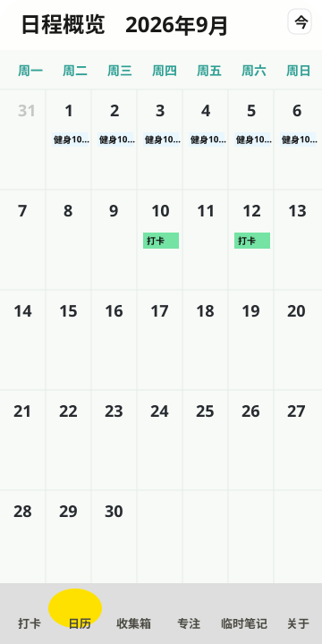
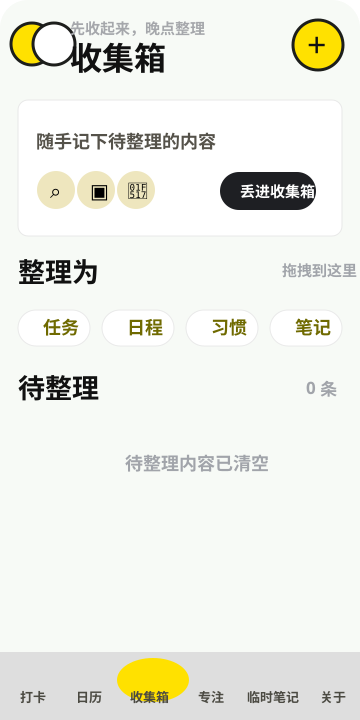
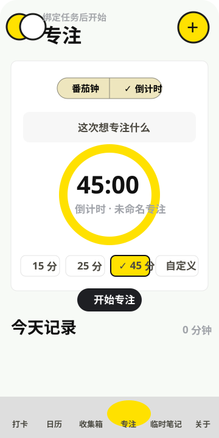
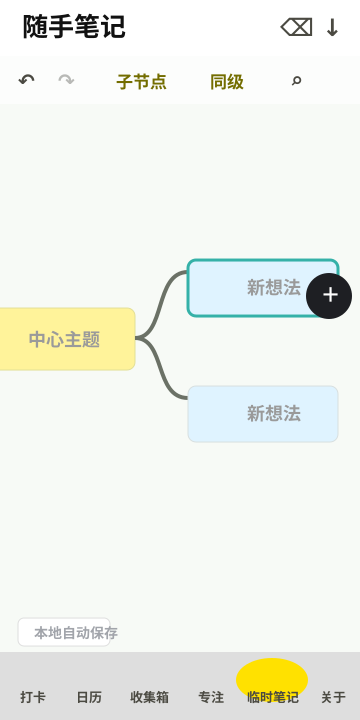

# 日程岛

日程岛是一款由 **洵涵工作室** 维护的轻量、私人的日程与专注记录 APP。它把打卡、日历、收集箱、专注计时和随手笔记放在一起，适合用来记录每天真正要做的事，也适合把零散想法先收起来，等有空时再整理。

这个项目更偏向“自己的小工作台”，不做繁重的办公感，也不把简单记录变成复杂系统。数据以本地记录为主，界面尽量清爽直接。

## 界面预览

| 日历 | 收集箱 |
| --- | --- |
|  |  |

| 专注 | 随手笔记 |
| --- | --- |
|  |  |

## 主要功能

- **今日打卡**：只显示今天需要处理的打卡任务，新的一天自动按真实日期显示新的任务状态。
- **日历概览**：支持按月份查看日程和打卡，支持跳转今天、左右切换月份，并可进入某一天查看当天内容。
- **收集箱**：先快速收起待整理内容，再拖拽整理为任务、日程、习惯、笔记四类；待整理内容可以编辑、标注时间，也可以打开已添加的图片内容。
- **专注计时**：支持番茄钟和倒计时，专注内容可以修改，完成后可保存到今日记录。
- **随手笔记**：提供轻量的节点式记录方式，适合临时梳理想法，本地自动保存。
- **关于页面**：包含版权说明、隐私说明、免责声明和“支持开发者”入口。

## 下载

当前 APK 文件名：

```text
日程岛.apk
```

建议通过 GitHub Releases 发布正式 APK，便于保留版本记录和校验信息：

https://github.com/baymax333/richengdao/releases

当前构建文件的 SHA-256：

```text
42CF4C9B5B57406ED9F2B3F49FE397B1BCE1F3CF88D0C5F17454DC88547EDBC9
```

## 爱发电支持

爱发电主页：

https://afdian.com/a/xunhanstudio

爱发电页面仅用于接受自愿支持。支持不是购买行为，也不构成任何功能解锁、会员服务、售后服务、定制开发、专属内容或持续更新承诺。

无论是否支持，日程岛均可正常下载和使用。请根据自身情况理性决定；未成年人请在监护人同意和指导下操作。

## 隐私与本地数据

日程岛以本地记录为主，任务、打卡、专注记录、收集箱内容和随手笔记默认保存在设备本地。卸载 APP、清理应用数据、系统故障或更换设备可能导致本地数据丢失，请自行注意备份。

更详细说明见：

- [隐私说明](PRIVACY.md)
- [支持与法律说明](SUPPORT_AND_LEGAL.md)

## 版权与发布说明

日程岛由洵涵工作室出品和维护。

本仓库用于项目介绍、公开发布说明和后续版本记录。仓库中的源代码、文档、图标、背景图和其他素材的授权范围，以后续正式 LICENSE 或仓库说明为准。

未经明确授权，不应假冒洵涵工作室名义重新发布、收费分发或进行误导性传播。

## 反馈

如发现问题或有建议，可以通过 GitHub Issues 留言。留言会被认真参考，但不承诺固定响应时间、永久维护或必然实现建议。
