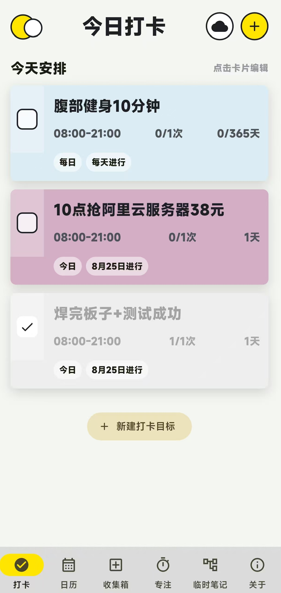
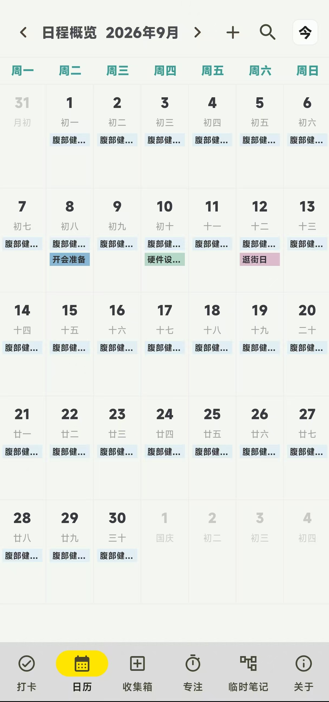
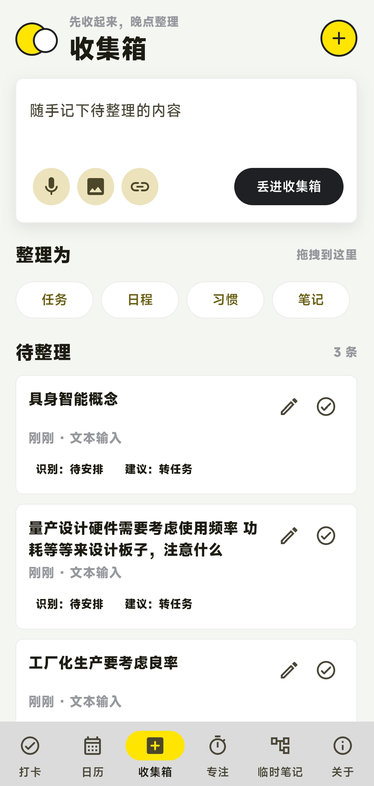
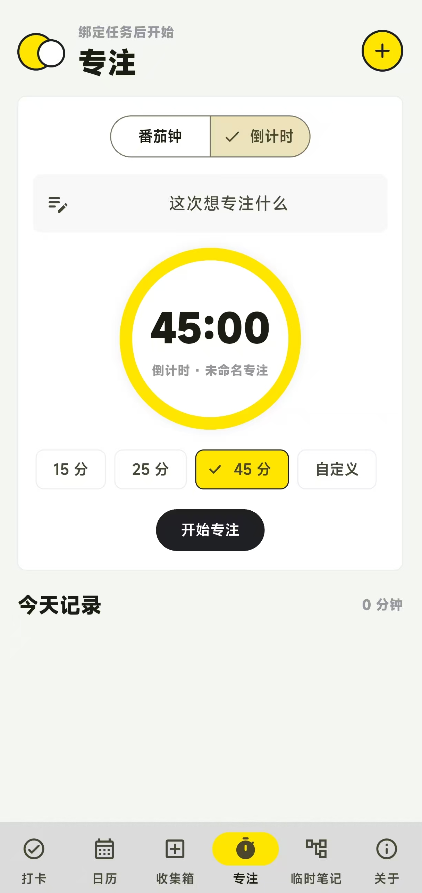
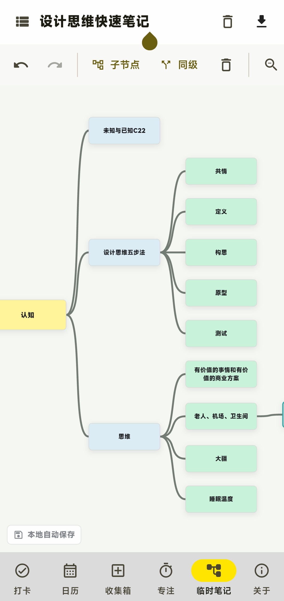

# 日程岛

日程岛是一款把打卡、日历、收集箱、专注计时和临时笔记放在一起的APP，适合用来记录每天真正要做的事，也适合把零散想法先收起来，等有空时再整理。

这个项目更偏向“自己的小工作台”，不做繁重的办公感，也不把简单记录变成复杂系统。数据以本地记录为主，界面尽量清爽直接。

## 界面预览

<table>
  <tr>
    <td align="center" width="33%">
      <strong>今日打卡</strong> 
      
    </td>
    <td align="center" width="33%">
      <strong>日历概览</strong> 
      
    </td>
    <td align="center" width="33%">
      <strong>收集箱</strong> 
      
    </td>
  </tr>
  <tr>
    <td align="center">首页只展示今天需要完成的打卡，新的日期会进入新的当天状态，不把过去或未来的内容混在一起。</td>
    <td align="center">用月视图查看日程概况，支持切换月份、跳转今天，并进入具体日期查看当天安排。</td>
    <td align="center">先把临时事项、想法、图片或链接放进收集箱，再拖拽整理到任务、日程、习惯、笔记四类。</td>
  </tr>
</table>

<table>
  <tr>
    <td align="center" width="50%">
      <strong>专注</strong> 
      
    </td>
    <td align="center" width="50%">
      <strong>临时笔记</strong> 
      
    </td>
  </tr>
  <tr>
    <td align="center">选择合适时长后开始倒计时，专注内容可编辑，完成后可以保存到今日记录。</td>
    <td align="center">用节点式方式快速写下想法和结构，适合临时梳理计划、灵感和待完善的内容。</td>
  </tr>
</table>

## 主要功能

- **今日打卡**：只显示今天需要处理的打卡任务，新的一天自动按真实日期显示新的任务状态。
- **日历概览**：支持按月份查看日程和打卡，支持跳转今天、左右切换月份，并可进入某一天查看当天内容。
- **收集箱**：先快速收起待整理内容，再拖拽整理为任务、日程、习惯、笔记四类；待整理内容可以编辑、标注时间，也可以打开已添加的图片内容。
- **专注计时**：支持番茄钟和倒计时，专注内容可以修改，完成后可保存到今日记录。
- **临时笔记**：提供轻量的节点式记录方式，适合临时梳理想法，本地自动保存。
- **关于页面**：包含版权说明、隐私说明、免责声明和“支持开发者”入口。

## 下载

当前公开版本：**日程岛 v0.1.0**

- [立即下载 APK](https://github.com/baymax333/richengdao/releases/download/v0.1.0/default.apk)
- [查看发布页](https://github.com/baymax333/richengdao/releases/tag/v0.1.0)
- [查看最新版本](https://github.com/baymax333/richengdao/releases/latest)

说明：Android 安装第三方 APK 时，系统可能提示“未知来源应用”。请确认下载地址来自本仓库后再安装。

## 爱发电支持

爱发电主页：

https://afdian.com/a/xunhanstudio

爱发电页面仅用于接受自愿支持。支持不是购买行为，也不构成任何功能解锁、会员服务、售后服务、定制开发、专属内容或持续更新承诺。

无论是否支持，日程岛均可正常下载和使用。请根据自身情况理性决定；未成年人请在监护人同意和指导下操作。

## 隐私与本地数据

日程岛以本地记录为主，任务、打卡、专注记录、收集箱内容和临时笔记默认保存在设备本地。卸载 APP、清理应用数据、系统故障或更换设备可能导致本地数据丢失，请自行注意备份。

更详细说明见：

- [隐私说明](PRIVACY.md)
- [支持与法律说明](SUPPORT_AND_LEGAL.md)

## 版权与发布说明

日程岛由洵涵工作室出品和维护。

本仓库用于项目介绍、公开发布说明和后续版本记录。仓库中的源代码、文档、图标、背景图和其他素材的授权范围，以后续正式 LICENSE 或仓库说明为准。

未经明确授权，不应假冒洵涵工作室名义重新发布、收费分发或进行误导性传播。

## 反馈

如发现问题或有建议，可以通过 GitHub Issues 留言。留言会被认真参考，但不承诺固定响应时间、永久维护或必然实现建议。
